# Product Engineering Tutorial: How to Create Comprehensive Project Documentation

## Table of Contents

1. [Introduction to Product Engineering Documentation](#introduction-to-product-engineering-documentation)
2. [How to Create Context Diagrams](#how-to-create-context-diagrams)
3. [How to Create Use Case Diagrams](#how-to-create-use-case-diagrams)
4. [How to Create Data Flow Diagrams](#how-to-create-data-flow-diagrams)
5. [How to Create Entity Relationship Diagrams](#how-to-create-entity-relationship-diagrams)
6. [How to Create System Architecture Diagrams](#how-to-create-system-architecture-diagrams)
7. [How to Create Project Management Diagrams](#how-to-create-project-management-diagrams)
8. [How to Create Sequence Diagrams](#how-to-create-sequence-diagrams)
9. [Best Practices for Documentation](#best-practices-for-documentation)
10. [Tools and Templates](#tools-and-templates)

## Introduction to Product Engineering Documentation

### What is Product Engineering Documentation?

Product Engineering Documentation is the systematic process of creating comprehensive visual and textual representations of your product's architecture, workflows, and processes. This tutorial will teach you **HOW** to create these documents for any project, using the AAIE (Artificial Assessment Intelligence for Educators) project as a practical example.

### Why Documentation Matters

- **Communication**: Ensures all stakeholders understand the system
- **Planning**: Helps identify requirements and dependencies
- **Development**: Guides implementation and testing
- **Maintenance**: Facilitates future updates and modifications
- **Onboarding**: Helps new team members understand the system

## How to Create Context Diagrams

### Step 1: Identify Your System Boundaries

**What is a Context Diagram?**
A context diagram shows your system as a single process with its inputs, outputs, and external entities. It's the highest level view of your system.

**How to Create One:**

#### Step 1.1: Define Your Core System

- **Identify the main system**: What is the central purpose of your product?
- **Example**: For AAIE, the core system is "Educational Assessment Platform"
- **Write it down**: Create a clear, concise description of what your system does

#### Step 1.2: Identify External Entities

**Ask yourself these questions:**

- Who will use your system? (Users, customers, administrators)
- What external systems will your system interact with? (APIs, databases, third-party services)
- Who are the stakeholders? (Business leaders, regulatory bodies, partners)

**For AAIE, we identified:**

- **Users**: Educators, Students
- **External Systems**: AI Services, Cloud Infrastructure
- **Stakeholders**: Educational Institutions

#### Step 1.3: Define Information Flows

**For each external entity, ask:**

- What information do they send to your system?
- What information does your system send back to them?
- What are the key data flows?

**Example for AAIE:**

- Educators → System: Assignment requirements, rubrics
- System → Educators: Analytics, reports
- Students → System: Submissions, feedback requests
- System → Students: Feedback, scores

### Step 2: Organize into Layers

#### Layer 1: External Systems

- List all external entities that interact with your system
- Include their roles and responsibilities
- Note their relationship to your system

#### Layer 2: Your System Components

- Break down your system into major components
- Include development teams, processes, and internal systems
- Show how they work together

#### Layer 3: Core Processes

- Identify the main workflows your system supports
- List the key processes in logical order
- Show how information flows through these processes

### Step 3: Document Information Flow

**Create a narrative that explains:**

- How external entities interact with your system
- What triggers each process
- How data flows between components
- What outputs are generated

### Step 4: Validate Your Context Diagram

**Checklist:**

- [ ] All major stakeholders are included
- [ ] All external systems are identified
- [ ] Information flows are clearly defined
- [ ] System boundaries are well-defined
- [ ] The diagram tells a complete story

### Example: AAIE Context Diagram Structure

**External Systems Layer:**

- Educators (create assignments, view analytics)
- Students (submit assignments, receive feedback)
- Educational Institutions (adopt platform, manage users)
- AI Services (provide classification and evaluation)
- Cloud Infrastructure (host system, store data)

**System Layer:**

- Frontend Team (user interface development)
- Backend Team (API and business logic)
- AI Integration Team (AI service management)
- DevOps Team (deployment and monitoring)
- Product Management (feature planning and requirements)

**Core Processes Layer:**

1. Assignment Creation → 2. Submission Processing → 3. AI Classification → 4. Rubric Evaluation → 5. Feedback Generation → 6. Analytics & Reporting

## How to Create Use Case Diagrams

### Step 1: Identify Your Actors

**What is a Use Case Diagram?**
A use case diagram shows the interactions between users (actors) and your system. It helps you understand who will use your system and what they want to accomplish.

**How to Create One:**

#### Step 1.1: Identify Primary Actors

**Ask yourself:**

- Who will directly use your system?
- What are their main roles and responsibilities?
- What do they want to achieve with your system?

**Common Actor Types:**

- **End Users**: People who use your product daily
- **Administrators**: People who manage and configure the system
- **External Systems**: APIs, services, or other systems that interact with yours
- **Development Team**: People who build and maintain the system

**For AAIE, we identified:**

- **Educator**: Primary user who creates assignments and views analytics
- **Student**: Primary user who submits assignments and receives feedback
- **System Administrator**: Manages the platform and user accounts
- **AI Service**: External system that provides AI capabilities

#### Step 1.2: Identify Secondary Actors

**These are actors that support or enable the primary actors:**

- **Development Team**: Frontend, Backend, AI Integration developers
- **Stakeholders**: Business leaders, decision makers
- **External Services**: Third-party APIs, databases, cloud services

### Step 2: Define Use Cases

#### Step 2.1: Identify Primary Use Cases

**For each actor, ask:**

- What are the main things they want to do with your system?
- What are their primary goals and objectives?
- What workflows do they need to complete?

**Use Case Naming Convention:**

- Use action verbs: "Create", "View", "Manage", "Submit"
- Be specific: "Create Assignment" not just "Create"
- Include the object: "View Analytics" not just "View"

#### Step 2.2: Group Use Cases by Actor

**Organize use cases by who performs them:**

**For AAIE Educators:**

- Create Assignment
- Manage Rubrics
- View Analytics
- Export Reports

**For AAIE Students:**

- Submit Assignment
- View Feedback
- Track Progress

**For AAIE AI Service:**

- Classify Submission
- Evaluate Rubric
- Generate Feedback
- Calculate Confidence

### Step 3: Define Actor-Use Case Relationships

#### Step 3.1: Map Actors to Use Cases

**For each use case, identify:**

- Which actor(s) can perform this use case
- What permissions or roles are required
- What the actor needs to accomplish the use case

#### Step 3.2: Identify Use Case Dependencies

**Some use cases depend on others:**

- "View Feedback" depends on "Submit Assignment"
- "Generate Report" depends on "View Analytics"
- "Evaluate Rubric" depends on "Classify Submission"

### Step 4: Create the Process Flow

#### Step 4.1: Define the Main Workflow

**Identify the primary user journey:**

1. What triggers the workflow?
2. What are the main steps?
3. What are the decision points?
4. What are the outcomes?

#### Step 4.2: Document Alternative Flows

**Consider:**

- What happens if something goes wrong?
- Are there different paths for different user types?
- What are the edge cases?

### Step 5: Validate Your Use Case Diagram

**Checklist:**

- [ ] All major user types are represented as actors
- [ ] All primary workflows are captured as use cases
- [ ] Actor-use case relationships are clearly defined
- [ ] Use case dependencies are identified
- [ ] The main process flow is documented

### Example: AAIE Use Case Structure

**Primary Actors:**

- **Educator**: Creates assignments, manages rubrics, views analytics
- **Student**: Submits assignments, views feedback, tracks progress
- **System Administrator**: Manages users, configures system, monitors performance
- **AI Service**: Classifies submissions, evaluates rubrics, generates feedback

**Use Case Categories:**

- **Educational Management**: Assignment creation, rubric management, analytics
- **Student Interaction**: Submission, feedback viewing, progress tracking
- **AI Processing**: Classification, evaluation, feedback generation
- **System Administration**: User management, system configuration, monitoring
- **Development**: Frontend development, API creation, AI integration, deployment

**Process Flow:**

1. Educator creates assignment → 2. Student submits assignment → 3. AI classifies and evaluates → 4. System generates feedback → 5. Student views feedback → 6. Educator views analytics

## How to Create Data Flow Diagrams

### Step 1: Identify External Entities

**What is a Data Flow Diagram (DFD)?**
A DFD shows how data moves through your system. It helps you understand what data your system processes and how it flows between different components.

**How to Create One:**

#### Step 1.1: Identify External Entities

**External entities are sources or destinations of data outside your system:**

- **Users**: People who interact with your system
- **Administrators**: People who manage the system
- **External Systems**: APIs, databases, or other systems
- **Data Sources**: Files, databases, or external data providers

**For AAIE, we identified:**

- **Educator**: Creates assignments and accesses analytics
- **Student**: Submits assignments and receives feedback
- **AI Service**: Provides AI classification and evaluation
- **MongoDB**: Stores all system data

#### Step 1.2: Define Data Flows

**For each external entity, identify:**

- What data do they send to your system?
- What data does your system send back to them?
- What are the key data exchanges?

### Step 2: Identify Core Processing Functions

#### Step 2.1: Break Down Your System into Processes

**Think of your system as a series of processes that transform data:**

- **Authentication**: Validates user credentials
- **Data Processing**: Processes and transforms data
- **Business Logic**: Applies business rules
- **Storage**: Saves data to databases
- **Response Generation**: Creates outputs for users

#### Step 2.2: Number Your Processes

**Use a numbering system to organize processes:**

- 1.0 User Authentication
- 2.0 Assignment Management
- 3.0 Submission Processing
- 4.0 AI Classification & Evaluation
- 5.0 Data Storage & Retrieval
- 6.0 Response Generation

### Step 3: Define Data Stores

#### Step 3.1: Identify Data Storage Systems

**What data does your system need to store?**

- **User Data**: Accounts, profiles, authentication
- **Business Data**: Core application data
- **Logs**: System activities, errors, audit trails
- **Analytics**: Performance metrics, usage data

#### Step 3.2: Map Data to Storage

**For each data type, identify:**

- Where is it stored?
- How is it accessed?
- What are the relationships?

### Step 4: Document Data Flow Patterns

#### Step 4.1: Trace Data Through Your System

**Follow data from input to output:**

1. Where does data enter your system?
2. How is it processed?
3. Where is it stored?
4. How is it retrieved?
5. What outputs are generated?

#### Step 4.2: Identify Data Transformations

**For each process, document:**

- What data comes in?
- How is it transformed?
- What data comes out?
- What business rules are applied?

### Step 5: Validate Your Data Flow Diagram

**Checklist:**

- [ ] All external entities are identified
- [ ] All major processes are documented
- [ ] Data flows are clearly defined
- [ ] Data stores are properly mapped
- [ ] The complete data journey is traceable

### Example: AAIE Data Flow Structure

**External Entities:**

- **Educator**: Sends assignment data, receives analytics
- **Student**: Sends submissions, receives feedback
- **AI Service**: Receives submission data, sends classification results
- **MongoDB**: Stores and retrieves all system data

**Core Processing Functions:**

- **1.0 User Authentication**: Validates credentials and manages sessions
- **2.0 Assignment Management**: Processes assignment creation and management
- **3.0 Submission Processing**: Handles student submissions and file processing
- **4.0 AI Classification & Evaluation**: Processes AI analysis and scoring
- **5.0 Data Storage & Retrieval**: Manages database operations
- **6.0 Response Generation**: Creates outputs for users

**Data Storage Systems:**

- **Assignment Database**: Assignment definitions and rubrics
- **Submission Database**: Student submissions and files
- **User Database**: User accounts and profiles
- **Analytics Database**: Performance metrics and insights

**Data Flow Patterns:**

1. Educator creates assignment → Assignment Database
2. Student submits assignment → Submission Processing
3. Submission → AI Service for analysis
4. AI results → Data Storage for persistence
5. Evaluation results → Student feedback display
6. Analytics data → Educator dashboard

## How to Create Entity Relationship Diagrams

### Step 1: Identify Your Core Entities

**What is an Entity Relationship Diagram (ERD)?**
An ERD shows the structure of your database and how different data entities relate to each other. It helps you design your database schema.

**How to Create One:**

#### Step 1.1: Identify Core Business Entities

**Think about the main "things" in your system:**

- **Users**: People who use your system
- **Content**: The main data your system manages
- **Transactions**: Actions or processes that create data
- **Categories**: Ways to organize or classify data

**For AAIE, we identified:**

- **USER**: Educators and students who use the platform
- **ASSIGNMENT**: Educational assignments with rubrics
- **SUBMISSION**: Student submissions to assignments
- **EVALUATION**: AI evaluation results and feedback

#### Step 1.2: Define Entity Attributes

**For each entity, identify:**

- **Primary Key**: Unique identifier for each record
- **Attributes**: Properties or characteristics of the entity
- **Data Types**: What kind of data each attribute stores
- **Constraints**: Rules about what data is allowed

### Step 2: Define Entity Relationships

#### Step 2.1: Identify Relationships Between Entities

**Ask yourself:**

- How do entities connect to each other?
- What are the business rules that govern these relationships?
- What are the cardinalities (one-to-one, one-to-many, many-to-many)?

**Common Relationship Types:**

- **One-to-One**: Each entity relates to exactly one other entity
- **One-to-Many**: One entity can relate to many others
- **Many-to-Many**: Multiple entities can relate to multiple others

#### Step 2.2: Document Relationship Rules

**For each relationship, define:**

- **Cardinality**: How many entities can be related
- **Optionality**: Whether the relationship is required or optional
- **Business Rules**: What constraints apply to the relationship

### Step 3: Design Your Database Schema

#### Step 3.1: Choose Your Database Type

**Consider:**

- **Relational (SQL)**: Structured data with clear relationships
- **Document (NoSQL)**: Flexible schema for varied data
- **Graph**: Complex relationships between entities
- **Key-Value**: Simple storage for specific use cases

#### Step 3.2: Design Tables/Collections

**For each entity:**

- Define the table/collection structure
- Specify data types and constraints
- Plan indexes for performance
- Consider data validation rules

### Step 4: Handle Complex Relationships

#### Step 4.1: Many-to-Many Relationships

**When entities have many-to-many relationships:**

- Create junction tables/collections
- Include additional attributes if needed
- Consider the business rules that apply

#### Step 4.2: Embedded vs Referenced Data

**For document databases:**

- **Embedded**: Store related data within the same document
- **Referenced**: Store references to other documents
- Consider data consistency and query performance

### Step 5: Validate Your ERD

**Checklist:**

- [ ] All major business entities are identified
- [ ] All relationships are properly defined
- [ ] Primary keys are clearly specified
- [ ] Data types and constraints are documented
- [ ] The schema supports all business requirements

### Example: AAIE Entity Structure

**Core Entities:**

- **USER**: user_id (PK), email, password, name, role, institution
- **ASSIGNMENT**: assignment_id (PK), domain, prompt, rubric, createdBy
- **SUBMISSION**: submission_id (PK), assignment_id (FK), student_id, content
- **EVALUATION**: evaluation_id (PK), submission_id (FK), classification, confidence

**Entity Relationships:**

- **USER to ASSIGNMENT**: One educator creates many assignments
- **ASSIGNMENT to SUBMISSION**: One assignment has many student submissions
- **SUBMISSION to EVALUATION**: One submission has one evaluation result
- **USER to SUBMISSION**: One student submits many assignments

**Data Integrity Constraints:**

- User roles determine assignment creation permissions
- Assignment ownership is maintained through createdBy field
- Submission status tracks evaluation progress
- AI classification includes confidence scores for reliability

## How to Create System Architecture Diagrams

### Step 1: Define Your System Boundaries

**What is a System Architecture Diagram?**
A system architecture diagram shows how your system components interact with external systems and actors. It defines the boundaries of your system and its interfaces.

**How to Create One:**

#### Step 1.1: Identify Your Core System

**Define what your system does:**

- What is the main purpose of your system?
- What are the core capabilities?
- What makes it unique or valuable?

**For AAIE, the core system is:**

- Educational platform for AI-powered assessment
- Manages assignments, submissions, and evaluations
- Provides analytics and feedback to educators and students

#### Step 1.2: Identify External Actors

**Who interacts with your system?**

- **Primary Users**: People who use your system daily
- **Administrators**: People who manage and configure the system
- **Stakeholders**: People who have interest in the system's success
- **External Systems**: Other systems that integrate with yours

#### Step 1.3: Identify External Systems

**What external systems does your system depend on?**

- **Databases**: Data storage systems
- **APIs**: Third-party services and integrations
- **Cloud Services**: Hosting, storage, and infrastructure
- **Authentication**: User management and security services

### Step 2: Map System Interactions

#### Step 2.1: Define Actor Interactions

**For each external actor, document:**

- **Role**: What they do in relation to your system
- **Interaction**: How they interact with your system
- **Communication**: What data or information is exchanged

#### Step 2.2: Define System Integrations

**For each external system, document:**

- **Purpose**: Why your system needs this integration
- **Integration**: How the systems connect and communicate
- **Data Flow**: What data flows between the systems

### Step 3: Document System Boundaries

#### Step 3.1: Define What's Inside Your System

**List all components that are part of your system:**

- **Core Components**: Main functionality and business logic
- **Supporting Components**: Utilities, helpers, and supporting services
- **Data Components**: Data models, storage, and persistence

#### Step 3.2: Define What's Outside Your System

**List all external dependencies:**

- **External Services**: APIs, databases, cloud services
- **External Actors**: Users, administrators, stakeholders
- **External Systems**: Third-party platforms and integrations

### Step 4: Validate Your System Architecture

**Checklist:**

- [ ] All external actors are identified and their roles defined
- [ ] All external systems are identified and their purposes clear
- [ ] System boundaries are well-defined
- [ ] All major interactions are documented
- [ ] The architecture supports all business requirements

### Example: AAIE System Architecture

**Core System:**

- AAIE Educational Platform
- Coordinates assignment management, AI evaluation, and learning analytics
- Manages complete educational assessment workflow

**External Actors:**

- **Educators**: Create assignments, view analytics, manage rubrics
- **Students**: Submit assignments, receive feedback, track progress
- **System Administrators**: Manage users, configure system, monitor performance
- **Educational Institutions**: Adopt platform, manage users, access analytics

**External Systems:**

- **Google Gemini 1.5 Pro API**: AI classification and evaluation
- **MongoDB Database**: Data storage and persistence
- **File Storage System**: PDF and document management
- **LLM Pipeline Service**: AI processing and integration
- **Notification Service**: User communications and alerts
- **Analytics Service**: Performance tracking and insights

**System Interaction Patterns:**

- Educators interact with system to create assignments and view analytics
- Students interact with system to submit assignments and receive feedback
- AI services process submissions and provide educational insights
- Core system coordinates all educational workflows and data management

## How to Create Project Management Diagrams

### Step 1: Define Your Project Lifecycle

**What is a Project Management Diagram?**
A project management diagram shows the phases, activities, and workflows involved in managing your project from start to finish. It helps you plan, track, and coordinate project activities.

**How to Create One:**

#### Step 1.1: Identify Project Phases

**Break your project into major phases:**

- **Initiation**: Project start, requirements gathering, planning
- **Development**: Implementation, testing, iteration
- **Completion**: Final testing, deployment, closure
- **Post-Project**: Review, lessons learned, maintenance

#### Step 1.2: Define Phase Activities

**For each phase, identify:**

- **Key Activities**: What needs to be done
- **Participants**: Who is involved
- **Deliverables**: What is produced
- **Duration**: How long it takes
- **Dependencies**: What must happen first

### Step 2: Create Development Workflows

#### Step 2.1: Define Iterative Cycles

**Most projects use iterative development:**

- **Sprint Planning**: Plan work for each iteration
- **Development Work**: Implement features and functionality
- **Testing**: Validate work and ensure quality
- **Review**: Demonstrate progress and gather feedback
- **Retrospective**: Improve processes and identify issues

#### Step 2.2: Document Quality Gates

**Define decision points in your workflow:**

- **Quality Control**: What standards must be met?
- **Approval Points**: Who must approve work?
- **Go/No-Go Decisions**: When to proceed or stop?
- **Escalation**: When to involve stakeholders?

### Step 3: Map Stakeholder Interactions

#### Step 3.1: Identify Key Stakeholders

**Who is involved in your project?**

- **Project Manager**: Coordinates activities and resources
- **Development Team**: Builds the product
- **QA Team**: Ensures quality and testing
- **Stakeholders**: Provide requirements and feedback
- **Users**: Test and validate the product

#### Step 3.2: Define Communication Patterns

**How do stakeholders interact?**

- **Regular Meetings**: Daily standups, sprint reviews
- **Reporting**: Progress updates, status reports
- **Feedback**: User testing, stakeholder input
- **Decision Making**: Approval processes, change management

### Step 4: Document Process Flows

#### Step 4.1: Create Activity Sequences

**Map out the sequence of activities:**

1. What triggers each activity?
2. What are the inputs and outputs?
3. What are the decision points?
4. What are the alternative paths?

#### Step 4.2: Define Handoff Points

**Where does work transfer between people?**

- **Requirements**: From stakeholders to development team
- **Code**: From developers to QA team
- **Testing**: From QA team to stakeholders
- **Deployment**: From development team to operations

### Step 5: Validate Your Project Management Diagram

**Checklist:**

- [ ] All major project phases are identified
- [ ] All key activities are documented
- [ ] All stakeholders and their roles are defined
- [ ] All decision points and quality gates are clear
- [ ] The workflow supports successful project completion

### Example: AAIE Project Management Structure

**Project Phases:**

- **Initiation**: Educational requirements gathering, technical architecture planning
- **Development**: Frontend, backend, and AI integration development
- **Completion**: Educational testing, deployment, and handover

**Key Activities:**

- **Educational Requirements Gathering**: Collect needs from educators and students
- **Technical Architecture Planning**: Design system architecture and AI integration
- **Development Work**: Build React frontend, Node.js backend, Python AI pipeline
- **Educational Testing**: Test with real educators and students
- **Deployment**: Release to production with educational monitoring

**Stakeholders:**

- **Project Manager**: Coordinates educational development and AI integration
- **Development Team**: Frontend, backend, and AI specialists
- **Educational Stakeholders**: Educators, students, educational administrators
- **QA Team**: Educational and AI testing specialists

**Process Flow:**

1. Educational requirements gathering → 2. Technical architecture planning → 3. Development sprints → 4. Educational testing → 5. Deployment → 6. Post-project review

## How to Create Sequence Diagrams

### Step 1: Identify Your Participants

**What is a Sequence Diagram?**
A sequence diagram shows the interactions between different participants (actors, systems, or components) over time. It helps you understand the flow of communication and the order of operations.

**How to Create One:**

#### Step 1.1: Identify Key Participants

**Who or what is involved in your process?**

- **People**: Users, administrators, stakeholders
- **Systems**: Your system, external systems, databases
- **Components**: Different parts of your system
- **Services**: APIs, microservices, external services

**For AAIE, we identified:**

- **Product Manager**: Coordinates project activities
- **Development Team**: Builds the product
- **QA Team**: Tests and validates work
- **Educational Stakeholders**: Provide requirements and feedback
- **System**: The platform being developed

#### Step 1.2: Define Participant Roles

**For each participant, define:**

- **Role**: What they do in the process
- **Responsibilities**: What they are accountable for
- **Capabilities**: What they can do
- **Interactions**: How they communicate with others

### Step 2: Map Interaction Sequences

#### Step 2.1: Identify Key Workflows

**What are the main processes in your project?**

- **Requirements Gathering**: How requirements are collected and documented
- **Development Cycles**: How work is planned, executed, and reviewed
- **Quality Assurance**: How work is tested and validated
- **Stakeholder Engagement**: How feedback is collected and incorporated

#### Step 2.2: Document Message Flows

**For each interaction, document:**

- **Sender**: Who initiates the interaction
- **Receiver**: Who receives the message or request
- **Message**: What is being communicated
- **Response**: What is sent back
- **Timing**: When the interaction occurs

### Step 3: Define Process Phases

#### Step 3.1: Identify Major Phases

**Break your process into logical phases:**

- **Initiation**: Project start, requirements gathering, planning
- **Development**: Implementation, testing, iteration
- **Review**: Demonstration, feedback, approval
- **Completion**: Final testing, deployment, closure

#### Step 3.2: Map Phase Transitions

**How do you move from one phase to another?**

- **Triggers**: What starts each phase?
- **Conditions**: What must be true to proceed?
- **Decisions**: What choices are made?
- **Outcomes**: What results from each phase?

### Step 4: Document Iterative Cycles

#### Step 4.1: Define Repeating Processes

**Most projects have iterative cycles:**

- **Sprint Planning**: Plan work for each iteration
- **Development Work**: Implement features and functionality
- **Testing**: Validate work and ensure quality
- **Review**: Demonstrate progress and gather feedback
- **Retrospective**: Improve processes and identify issues

#### Step 4.2: Map Cycle Dependencies

**How do cycles relate to each other?**

- **Prerequisites**: What must happen before each cycle?
- **Dependencies**: What does each cycle depend on?
- **Outputs**: What does each cycle produce?
- **Inputs**: What does each cycle need to start?

### Step 5: Validate Your Sequence Diagram

**Checklist:**

- [ ] All key participants are identified and their roles defined
- [ ] All major workflows are documented
- [ ] All message flows are clearly defined
- [ ] All process phases are identified
- [ ] All iterative cycles are documented

### Example: AAIE Sequence Diagram Structure

**Key Participants:**

- **Product Manager**: Coordinates educational development and AI integration
- **Development Team**: Frontend, backend, and AI specialists
- **QA Team**: Educational and AI testing specialists
- **Educational Stakeholders**: Educators, students, educational administrators
- **System**: AAIE educational platform

**Major Workflows:**

- **Educational Requirements Gathering**: Collect needs from educators and students
- **Technical Architecture Planning**: Design system architecture and AI integration
- **Development Sprints**: Build React frontend, Node.js backend, Python AI pipeline
- **Educational Testing**: Test with real educators and students
- **Deployment**: Release to production with educational monitoring

**Process Phases:**

- **Initiation**: Educational requirements gathering, technical architecture planning
- **Development**: Frontend, backend, and AI integration development
- **Review**: Educational testing, stakeholder feedback, approval
- **Completion**: Final testing, deployment, handover

**Iterative Cycles:**

- **Sprint Planning**: Plan educational features and AI integration
- **Development Work**: Execute educational development work
- **Testing**: Comprehensive testing of educational features and AI evaluation
- **Review**: Demonstrate completed educational features to stakeholders
- **Retrospective**: Reflect on educational development process and identify improvements

## Best Practices for Documentation

### 1. Start with the Big Picture

**Begin with high-level diagrams:**

- **Context Diagrams**: Understand your system's place in the world
- **Use Case Diagrams**: Identify who uses your system and why
- **System Architecture**: Define your system's boundaries and interfaces

**Then drill down into details:**

- **Data Flow Diagrams**: Understand how data moves through your system
- **Entity Relationship Diagrams**: Design your database structure
- **Sequence Diagrams**: Map out specific workflows and interactions

### 2. Use Consistent Naming Conventions

**Entity Naming:**

- Use clear, descriptive names
- Use consistent terminology throughout
- Avoid abbreviations unless they're widely understood
- Use business language, not technical jargon

**Process Naming:**

- Use action verbs: "Create", "Update", "Delete", "Process"
- Be specific: "Create Assignment" not just "Create"
- Include the object: "View Analytics" not just "View"

### 3. Validate with Stakeholders

**Regular Review Cycles:**

- **Initial Review**: Validate requirements and assumptions
- **Mid-Project Review**: Ensure alignment with development
- **Final Review**: Confirm accuracy and completeness
- **Ongoing Updates**: Keep documentation current

**Stakeholder Involvement:**

- **Users**: Validate use cases and workflows
- **Developers**: Confirm technical feasibility
- **Business Stakeholders**: Ensure business alignment
- **QA Team**: Verify testability and quality

### 4. Keep Documentation Current

**Version Control:**

- Track changes to documentation
- Maintain version history
- Document what changed and why
- Ensure all stakeholders have access to current versions

**Regular Updates:**

- Update documentation when requirements change
- Reflect actual implementation in documentation
- Remove outdated information
- Add new insights and learnings

### 5. Make Documentation Accessible

**Clear Structure:**

- Use consistent formatting and layout
- Include table of contents and navigation
- Use headings and subheadings effectively
- Include cross-references between documents

**Visual Clarity:**

- Use diagrams to illustrate concepts
- Include examples and use cases
- Use consistent symbols and notation
- Ensure diagrams are readable and understandable

## Tools and Templates

### Documentation Tools

#### Diagramming Tools

- **Lucidchart**: Professional diagramming with collaboration features
- **Draw.io**: Free, open-source diagramming tool
- **Visio**: Microsoft's diagramming solution
- **Miro**: Collaborative whiteboarding and diagramming

#### Documentation Platforms

- **Confluence**: Team collaboration and documentation
- **Notion**: All-in-one workspace for documentation
- **GitBook**: Modern documentation platform
- **Markdown**: Simple, portable documentation format

#### Version Control

- **Git**: Track changes to documentation
- **GitHub**: Host and collaborate on documentation
- **GitLab**: Alternative Git hosting platform
- **Bitbucket**: Atlassian's Git hosting solution

### Templates and Examples

#### Context Diagram Template

```
External Systems Layer:
- [User Type]: [Role and responsibilities]
- [External System]: [Purpose and integration]
- [Stakeholder]: [Interest and involvement]

System Layer:
- [Component]: [Functionality and purpose]
- [Process]: [What it does and how]
- [Service]: [Capabilities and features]

Core Processes Layer:
1. [Process 1] → 2. [Process 2] → 3. [Process 3] → 4. [Process 4]
```

#### Use Case Template

```
Primary Actors:
- [Actor 1]: [Role and responsibilities]
- [Actor 2]: [Role and responsibilities]
- [External System]: [Purpose and capabilities]

Use Case Categories:
- [Category 1]: [Use cases and descriptions]
- [Category 2]: [Use cases and descriptions]
- [Category 3]: [Use cases and descriptions]

Process Flow:
1. [Step 1] → 2. [Step 2] → 3. [Step 3] → 4. [Step 4]
```

#### Data Flow Template

```
External Entities:
- [Entity 1]: [Data sent to system, data received from system]
- [Entity 2]: [Data sent to system, data received from system]

Core Processing Functions:
- [Function 1]: [Input, processing, output]
- [Function 2]: [Input, processing, output]
- [Function 3]: [Input, processing, output]

Data Storage Systems:
- [Storage 1]: [Data stored, access patterns]
- [Storage 2]: [Data stored, access patterns]

Data Flow Patterns:
1. [Source] → [Process] → [Storage] → [Output]
```

### Getting Started Checklist

**Initial Setup:**

- [ ] Choose your documentation tools
- [ ] Set up version control for documentation
- [ ] Create initial project structure
- [ ] Identify key stakeholders and reviewers

**First Documentation Cycle:**

- [ ] Create context diagram
- [ ] Identify use cases and actors
- [ ] Map data flows
- [ ] Design database schema
- [ ] Document system architecture

**Validation and Review:**

- [ ] Review with stakeholders
- [ ] Validate technical feasibility
- [ ] Ensure business alignment
- [ ] Update based on feedback

**Ongoing Maintenance:**

- [ ] Keep documentation current
- [ ] Regular stakeholder reviews
- [ ] Version control and change tracking
- [ ] Continuous improvement based on feedback

---

**Document Version**: 1.0
**Last Updated**: 2024
**Purpose**: Tutorial on creating comprehensive product engineering documentation
**Target Audience**: Product managers, developers, system architects, project managers

## Engineering Design Process

### Design Thinking Framework

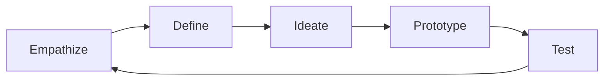

#### 1. Empathize

- **User Research**: Understand user needs, pain points, and behaviors
- **Stakeholder Interviews**: Gather insights from all relevant parties
- **Observation**: Watch users interact with existing solutions
- **Data Analysis**: Analyze usage patterns and feedback

#### 2. Define

- **Problem Statement**: Clearly articulate the problem to be solved
- **User Personas**: Create detailed user profiles
- **Requirements**: Define functional and non-functional requirements
- **Success Criteria**: Establish measurable success metrics

#### 3. Ideate

- **Brainstorming**: Generate multiple solution concepts
- **Design Workshops**: Collaborative ideation sessions
- **Technology Exploration**: Research available technologies
- **Solution Mapping**: Map solutions to user needs

#### 4. Prototype

- **Low-fidelity Prototypes**: Quick sketches and wireframes
- **High-fidelity Prototypes**: Detailed interactive prototypes
- **Technical Prototypes**: Proof-of-concept implementations
- **User Journey Maps**: Visualize user interactions

#### 5. Test

- **User Testing**: Validate prototypes with real users
- **A/B Testing**: Compare different solutions
- **Usability Testing**: Assess ease of use
- **Performance Testing**: Validate technical feasibility

### System Design Principles

#### 1. Scalability

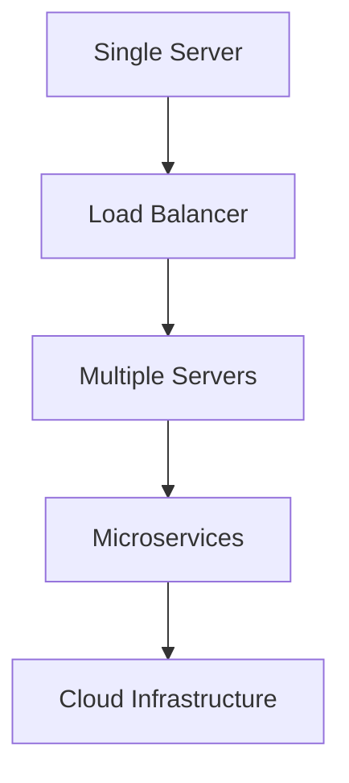

#### 2. Reliability

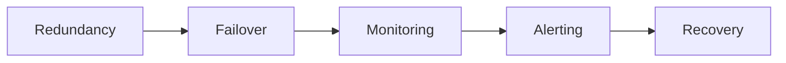

#### 3. Security

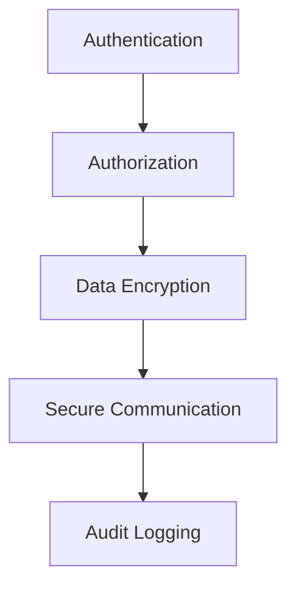

#### 4. Performance

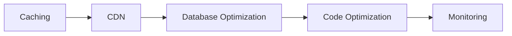

## System Architecture

### AAIE Data Flow Diagram (DFD)

**System Data Flow Overview:**

**External Entities:**

- **Educator**: Teachers who create assignments and access analytics
- **Student**: Learners who submit assignments and receive feedback
- **AI Service**: Google Gemini 1.5 Pro API for classification and evaluation
- **MongoDB**: Database system storing assignments, submissions, and evaluations

**Core Processing Functions:**

**1.0 User Authentication Process:**

- Validates educator and student credentials against user database
- Manages role-based access control (educator/student permissions)
- Interacts with User Database to verify identity and roles
- Generates JWT tokens for session management

**2.0 Assignment Management:**

- Processes assignment creation requests from educators
- Validates rubric structure and assignment parameters
- Stores assignment data with rubric definitions
- Manages assignment status and due dates

**3.0 Submission Processing:**

- Receives PDF and text-based submissions from students
- Extracts text content from PDF files using pdf2json
- Validates submission format and content requirements
- Routes submissions to AI evaluation pipeline

**4.0 AI Classification & Evaluation:**

- Sends submission data to LLM pipeline for analysis
- Receives Human/AI/Hybrid classification with confidence scores
- Processes rubric evaluation using standardized dimensions
- Generates comprehensive educational feedback

**5.0 Data Storage & Retrieval:**

- Persists assignments, submissions, and evaluations to MongoDB
- Manages user profiles and authentication data
- Stores AI evaluation results and rubric scores
- Handles analytics data and reporting information

**6.0 Response Generation:**

- Formats evaluation results for student feedback display
- Generates analytics reports for educators
- Prepares assignment data for dashboard views
- Ensures proper data formatting for frontend consumption

**Data Storage Systems:**

- **Assignment Database**: Stores assignment definitions, rubrics, and metadata
- **Submission Database**: Contains student submissions and evaluation results
- **User Database**: Manages educator and student accounts and profiles
- **Analytics Database**: Tracks performance metrics and educational insights

**Data Flow Patterns:**

1. Educator creates assignment with rubric → Assignment Database
2. Student submits assignment → Submission Processing
3. Submission → AI Service for classification and evaluation
4. AI results → Data Storage for persistence
5. Evaluation results → Student feedback display
6. Analytics data → Educator dashboard and reports
7. All processes log activities for monitoring and debugging

### AAIE Entity Relationship Diagram (ERD)

**Database Entity Structure and Relationships:**

**Core Entities:**

**USER Entity:**

- **Primary Key**: user_id (ObjectId)
- **Attributes**: email, password, name, role (educator/admin), institution, created_at, updated_at
- **Purpose**: Stores educator and student account information with role-based access
- **Relationships**: Creates assignments, submits assignments, manages evaluations

**ASSIGNMENT Entity:**

- **Primary Key**: assignment_id (ObjectId)
- **Attributes**: domain, prompt, rubric (nested), submissions (array), isActive, createdBy, createdAt, updatedAt
- **Purpose**: Represents educational assignments with rubrics and submission tracking
- **Relationships**: Created by users, contains submissions, linked to evaluations

**SUBMISSION Entity:**

- **Primary Key**: submission_id (ObjectId)
- **Attributes**: assignment_id (FK), student_id, student_name, content, file_path, status, created_at, updated_at
- **Purpose**: Student submissions with content and metadata
- **Relationships**: Belongs to assignments, linked to evaluations, submitted by students

**EVALUATION Entity:**

- **Primary Key**: evaluation_id (ObjectId)
- **Attributes**: submission_id (FK), classification (Human/AI/Hybrid), confidence, rubric_scores (nested), llm_feedback, created_at
- **Purpose**: AI evaluation results with classification and rubric scoring
- **Relationships**: Evaluates submissions, contains rubric scores and feedback

**RUBRIC Entity (Embedded in Assignment):**

- **Attributes**: rubric_id, criteria (array with criterion_id, name, description, performance_descriptors)
- **Purpose**: Standardized evaluation criteria with performance descriptors
- **Relationships**: Embedded in assignments, used for evaluation scoring

**Entity Relationships:**

**One-to-Many Relationships:**

- **USER to ASSIGNMENT**: One educator can create multiple assignments
- **ASSIGNMENT to SUBMISSION**: One assignment can have multiple student submissions
- **SUBMISSION to EVALUATION**: One submission can have one evaluation result
- **USER to SUBMISSION**: One student can submit multiple assignments

**Embedded Relationships:**

- **ASSIGNMENT contains RUBRIC**: Rubric is embedded within assignment documents
- **EVALUATION contains RUBRIC_SCORES**: Rubric scores are embedded within evaluation documents

**Data Integrity Constraints:**

- ObjectId relationships ensure referential integrity in MongoDB
- User roles (educator/admin) determine assignment creation permissions
- Assignment ownership is maintained through createdBy field
- Submission status tracks evaluation progress (pending, evaluated, failed)
- Rubric scores are validated against standardized dimensions
- AI classification includes confidence scores for reliability assessment

### AAIE System Context Diagram

**System Boundary and External Interactions:**

**Core System:**
The AAIE (Artificial Assessment Intelligence for Educators) system serves as the central educational platform that coordinates assignment management, AI-powered evaluation, and learning analytics. It acts as the primary interface between educators, students, and AI services, managing the complete educational assessment workflow.

**External Actors and Their Interactions:**

**Educators:**

- **Role**: Teachers and instructors who create assignments and access analytics
- **Interaction**: Create assignments, define rubrics, view student performance analytics
- **Communication**: Assignment management, rubric configuration, analytics dashboard access

**Students:**

- **Role**: Learners who submit assignments and receive AI-powered feedback
- **Interaction**: Submit PDF/text assignments, view feedback, track learning progress
- **Communication**: Submission upload, feedback review, progress tracking

**System Administrators:**

- **Role**: Platform managers who configure and maintain the educational system
- **Interaction**: Manage user accounts, system settings, platform health monitoring
- **Communication**: Administrative controls, user management, system configuration

**Educational Institutions:**

- **Role**: Schools and universities that adopt the AAIE platform
- **Interaction**: Institutional analytics, bulk user management, compliance reporting
- **Communication**: Institutional dashboards, compliance data, usage analytics

**External Systems Integration:**

**Google Gemini 1.5 Pro API:**

- **Purpose**: Provides AI classification and evaluation capabilities
- **Integration**: Real-time AI analysis of student submissions for Human/AI/Hybrid detection
- **Data Flow**: Submission data → AI analysis → Classification results and confidence scores

**MongoDB Database:**

- **Purpose**: Stores all persistent educational data including assignments, submissions, and evaluations
- **Integration**: Primary data persistence layer for the entire AAIE system
- **Data Flow**: Read/write operations for assignments, submissions, evaluations, and user data

**File Storage System:**

- **Purpose**: Manages PDF file uploads and document storage
- **Integration**: Handles PDF submission storage, text extraction, and file management
- **Data Flow**: PDF upload → Text extraction → Content analysis → Storage

**LLM Pipeline Service:**

- **Purpose**: Python-based service that processes AI evaluation requests
- **Integration**: FastAPI service that coordinates with Gemini API for evaluation
- **Data Flow**: Backend requests → LLM pipeline → Gemini API → Evaluation results

**Notification Service:**

- **Purpose**: Sends real-time notifications for assignment updates and evaluation results
- **Integration**: Automated notification delivery for educational events
- **Data Flow**: System events → Notification generation → User notifications

**Analytics Service:**

- **Purpose**: Collects and analyzes educational performance data and learning insights
- **Integration**: Provides comprehensive analytics for educators and institutions
- **Data Flow**: Educational data collection → Analytics processing → Dashboard insights

**System Interaction Patterns:**

- Educators interact with the system to create assignments and view analytics
- Students interact with the system to submit assignments and receive feedback
- AI services process submissions and provide educational insights
- The core system coordinates all educational workflows and data management
- Each external service provides specialized functionality to support educational assessment

### AAIE Microservices Architecture

**Distributed Educational System Architecture:**

**Client Layer:**

- **React Frontend**: Modern web application with responsive UI
- **Purpose**: Provides educational interface for educators and students
- **Communication**: Sends API requests to backend services, receives educational data

**API Gateway Layer:**

- **Express.js API Gateway**: Central entry point for all educational requests
- **Functions**: Request routing, authentication, rate limiting, CORS handling
- **Benefits**: Single point of entry, consistent API interface, security enforcement
- **Communication**: Routes requests to appropriate educational microservices

**Microservices Layer:**

**Assignment Service:**

- **Responsibility**: Assignment management, rubric configuration, assignment lifecycle
- **Database**: Assignment Database (stores assignments, rubrics, metadata)
- **Features**: Assignment creation, rubric management, assignment status tracking
- **Independence**: Can be developed, deployed, and scaled independently

**Submission Service:**

- **Responsibility**: Student submission processing, file handling, submission tracking
- **Database**: Submission Database (stores student submissions, file paths, status)
- **Features**: PDF upload, text extraction, submission validation, status management
- **Independence**: Manages its own submission data and file operations

**Evaluation Service:**

- **Responsibility**: AI evaluation processing, rubric scoring, feedback generation
- **Database**: Evaluation Database (stores AI results, rubric scores, feedback)
- **Features**: AI classification, rubric evaluation, feedback generation, confidence scoring
- **Independence**: Handles AI processing and evaluation logic

**User Service:**

- **Responsibility**: User management, authentication, role-based access control
- **Database**: User Database (stores educator/student accounts, profiles, permissions)
- **Features**: User registration, login, profile management, role assignment
- **Independence**: Manages user authentication and authorization

**LLM Pipeline Service:**

- **Responsibility**: AI integration, Gemini API communication, AI processing
- **Database**: AI Database (stores AI requests, responses, processing logs)
- **Features**: AI classification, evaluation processing, confidence scoring
- **Independence**: Handles all AI-related operations and external API communication

**Database Layer:**

- **MongoDB Assignment Database**: Dedicated database for assignment and rubric data
- **MongoDB Submission Database**: Dedicated database for student submissions
- **MongoDB Evaluation Database**: Dedicated database for AI evaluation results
- **MongoDB User Database**: Dedicated database for user accounts and profiles

**Architecture Benefits:**

- **Independent Scaling**: Each educational service can be scaled based on usage patterns
- **Technology Diversity**: Frontend (React), Backend (Node.js), AI (Python)
- **Fault Isolation**: Failure in one service doesn't affect educational workflows
- **Team Autonomy**: Different teams can work on different educational services
- **Deployment Independence**: Services can be deployed and updated independently

**Communication Patterns:**

- **Synchronous**: Direct API calls between services through Express.js backend
- **Asynchronous**: Event-driven communication for AI processing and notifications
- **Data Consistency**: Each service maintains its own MongoDB collections
- **Service Discovery**: Services communicate through well-defined API endpoints

**Pros:**

- Independent scaling
- Technology diversity
- Fault isolation
- Team autonomy

**Cons:**

- Increased complexity
- Network latency
- Data consistency challenges
- Operational overhead

### AAIE Event-Driven Architecture

**Asynchronous Educational Communication System:**

**Event Publishers (Educational Services):**

**Assignment Service:**

- **Events Published**: Assignment created, assignment updated, assignment closed, rubric modified
- **Purpose**: Notifies other services about assignment lifecycle changes
- **Event Data**: Assignment ID, assignment details, rubric information, educator ID, timestamp

**Submission Service:**

- **Events Published**: Submission uploaded, submission processed, submission failed, file extracted
- **Purpose**: Informs other services about student submission events
- **Event Data**: Submission ID, student information, file details, processing status, timestamp

**Evaluation Service:**

- **Events Published**: Evaluation started, evaluation completed, evaluation failed, feedback generated
- **Purpose**: Communicates AI evaluation progress and results
- **Event Data**: Evaluation ID, submission ID, AI results, rubric scores, confidence levels

**User Service:**

- **Events Published**: User registered, user logged in, profile updated, role changed
- **Purpose**: Notifies other services about user account changes
- **Event Data**: User ID, user role, profile information, authentication status, timestamp

**LLM Pipeline Service:**

- **Events Published**: AI request sent, AI response received, classification completed, evaluation finished
- **Purpose**: Reports on AI processing status and results
- **Event Data**: Request ID, AI classification, confidence scores, processing time, error status

**Central Event Infrastructure:**

**Event Bus:**

- **Function**: Central message routing and distribution system for educational events
- **Capabilities**: Educational event queuing, routing, filtering, and delivery
- **Benefits**: Decouples educational services, enables asynchronous learning workflows, provides reliability
- **Technology**: Express.js event system, MongoDB change streams, or Redis pub/sub

**Event Store:**

- **Function**: Persistent storage for all educational system events
- **Purpose**: Educational audit trail, event sourcing, replay capabilities, learning analytics
- **Benefits**: Complete educational event history, system state reconstruction, compliance tracking
- **Data**: Event metadata, educational payload, timestamp, source service, event type

**Event Processing:**

- **Function**: Real-time processing and handling of educational events
- **Capabilities**: Event filtering, educational data transformation, workflow routing, learning logic execution
- **Benefits**: Real-time educational responsiveness, automated learning workflows, system coordination
- **Patterns**: Educational event handlers, learning processors, data transformers

**Architecture Benefits:**

**Loose Coupling:**

- Educational services don't need direct knowledge of each other
- Changes in one educational service don't affect others
- Services can be developed and deployed independently

**Scalability:**

- Each educational service can scale based on its event processing needs
- Event processing can be distributed across multiple instances
- Load balancing and horizontal scaling are simplified for educational workloads

**Reliability:**

- Educational events are persisted and can be replayed if needed
- Failed event processing can be retried for educational data integrity
- System state can be reconstructed from educational event history

**Flexibility:**

- New educational services can easily subscribe to existing events
- Event processing logic can be modified without affecting publishers
- Complex educational workflows can be built by chaining events

**Educational Event Flow Patterns:**

1. Educational service publishes event to Event Bus
2. Event Bus routes educational event to Event Store for persistence
3. Event Bus triggers Event Processing for real-time educational handling
4. Subscribed educational services receive and process events
5. Event processing may generate new educational events, creating learning event chains

### Cloud-Native Architecture

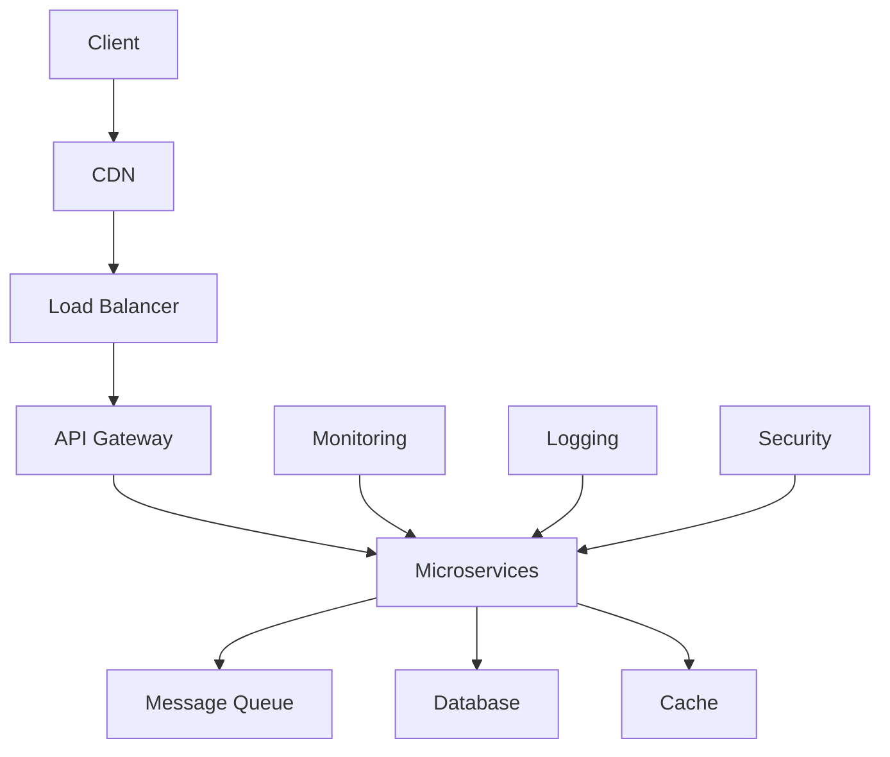

## Quality Assurance

### Testing Pyramid

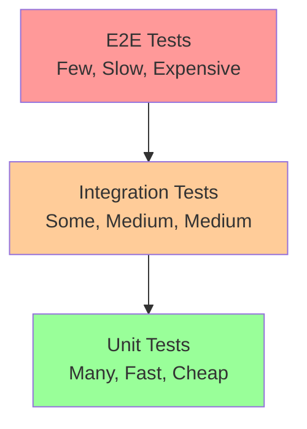

### Testing Strategy

#### 1. Unit Testing

- **Purpose**: Test individual components in isolation
- **Coverage**: 80%+ code coverage
- **Tools**: Jest, Mocha, JUnit
- **Frequency**: Every code change

#### 2. Integration Testing

- **Purpose**: Test component interactions
- **Scope**: API endpoints, database interactions
- **Tools**: Postman, Newman, RestAssured
- **Frequency**: Every build

#### 3. End-to-End Testing

- **Purpose**: Test complete user workflows
- **Scope**: Critical user journeys
- **Tools**: Selenium, Cypress, Playwright
- **Frequency**: Before releases

### Quality Metrics

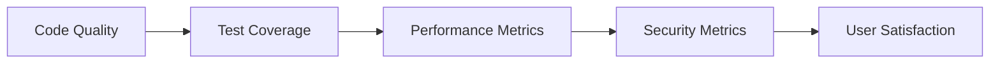

#### Code Quality Metrics

- **Cyclomatic Complexity**: Measure code complexity
- **Code Duplication**: Identify repeated code
- **Technical Debt**: Track technical debt
- **Code Review Coverage**: Ensure all code is reviewed

#### Performance Metrics

- **Response Time**: API and page load times
- **Throughput**: Requests per second
- **Resource Usage**: CPU, memory, disk usage
- **Scalability**: Performance under load

#### Security Metrics

- **Vulnerability Count**: Number of security issues
- **Security Test Coverage**: Security test coverage
- **Compliance Score**: Regulatory compliance
- **Incident Response Time**: Time to resolve security issues

## Project Management

### AAIE Project Management Sequence Diagram

**Educational Platform Development Workflow:**

**Project Initiation Phase:**

**Product Manager → Educational Stakeholders:**

- **Activity**: Gather educational requirements and user needs
- **Purpose**: Understand educator and student needs for AI-powered assessment
- **Deliverables**: Educational requirements document, user personas, success criteria
- **Duration**: 2-4 weeks

**Educational Stakeholders → Product Manager:**

- **Response**: Educational requirements document with detailed specifications
- **Content**: Assignment management needs, AI evaluation requirements, rubric specifications
- **Focus**: Educational workflows, learning outcomes, assessment standards

**Product Manager → Development Team:**

- **Activity**: Create educational user stories and AI integration requirements
- **Purpose**: Translate educational needs into technical development tasks
- **Deliverables**: User stories, technical specifications, AI integration plans
- **Duration**: 1-2 weeks

**Development Team → Product Manager:**

- **Response**: Story estimates and technical feasibility assessment
- **Content**: Development effort estimates, AI integration complexity, resource requirements
- **Focus**: Technical implementation challenges, AI service integration, educational data handling

**Product Manager → System:**

- **Activity**: Plan educational sprint with AI integration focus
- **Purpose**: Organize development work into manageable educational sprints
- **Deliverables**: Sprint backlog, educational priorities, AI integration milestones
- **Duration**: 1-2 days

**System → Product Manager:**

- **Response**: Sprint backlog with educational features prioritized
- **Content**: Assignment management, AI evaluation, user interface, analytics features
- **Focus**: Educational workflow optimization, AI integration planning

**Iterative Development Cycle:**

**Sprint Planning Phase:**

**Product Manager → Development Team:**

- **Activity**: Sprint planning for educational features and AI integration
- **Purpose**: Coordinate development work across frontend, backend, and AI teams
- **Participants**: Frontend developers, backend developers, AI specialists, QA team
- **Duration**: 1-2 days

**Development Work Phase:**

**Development Team → System:**

- **Activity**: Execute educational development work
- **Frontend Work**: React components for assignment management, submission interface, analytics dashboard
- **Backend Work**: Node.js APIs for educational data, user management, AI integration
- **AI Work**: Python LLM pipeline, Gemini API integration, evaluation algorithms
- **Duration**: 1-4 weeks per sprint

**Code Review Phase:**

**Development Team → QA Team:**

- **Activity**: Code review for educational features and AI integration
- **Purpose**: Ensure code quality, educational standards, and AI accuracy
- **Focus**: Educational UI/UX, API security, AI evaluation quality, performance
- **Duration**: Ongoing during development

**Testing Phase:**

**QA Team → System:**

- **Activity**: Comprehensive testing of educational features and AI evaluation
- **Types**: Unit testing, integration testing, educational user testing, AI evaluation testing
- **Focus**: Educational workflows, AI classification accuracy, rubric evaluation quality
- **Duration**: Continuous during and after development

**Bug Reporting Phase:**

**QA Team → Development Team:**

- **Response**: Bug reports for educational and AI evaluation issues
- **Content**: UI/UX issues, API problems, AI accuracy concerns, performance issues
- **Priority**: Critical educational workflow bugs, AI evaluation accuracy issues
- **Duration**: As needed during testing

**Bug Fixing Phase:**

**Development Team → System:**

- **Activity**: Address educational and AI evaluation issues
- **Process**: Issue identification, educational analysis, fix implementation, re-testing
- **Focus**: Educational workflow improvements, AI accuracy enhancements, performance optimization
- **Duration**: Variable based on issue complexity

**Sprint Review Phase:**

**Product Manager → Educational Stakeholders:**

- **Activity**: Demonstrate completed educational features and AI evaluation capabilities
- **Purpose**: Showcase educational platform progress and AI integration results
- **Participants**: Educators, students, educational administrators, technical stakeholders
- **Duration**: 1-2 hours

**Educational Stakeholders → Product Manager:**

- **Response**: Feedback on educational features and AI evaluation quality
- **Content**: Educational workflow feedback, AI accuracy assessment, user experience input
- **Focus**: Educational effectiveness, learning outcomes, assessment quality
- **Duration**: 1-2 hours

**Sprint Retrospective Phase:**

**Development Team → Product Manager:**

- **Activity**: Reflect on educational development process and identify improvements
- **Purpose**: Improve educational development workflow and AI integration processes
- **Participants**: All development team members, educational consultants
- **Duration**: 1-2 hours

**Release Planning Phase:**

**Product Manager → System:**

- **Activity**: Plan educational platform release with AI integration
- **Purpose**: Coordinate production deployment of educational features and AI services
- **Focus**: Educational platform stability, AI service reliability, user experience
- **Duration**: 1-2 weeks

**System → Product Manager:**

- **Response**: Release notes for educational platform and AI integration
- **Content**: Educational feature updates, AI evaluation improvements, bug fixes
- **Focus**: Educational impact, AI accuracy enhancements, platform improvements
- **Duration**: Ongoing

**Key AAIE Project Characteristics:**

- **Educational Focus**: All activities prioritize educational outcomes and learning effectiveness
- **AI Integration**: Continuous emphasis on AI evaluation quality and accuracy
- **Stakeholder Engagement**: Regular involvement of educators and students in development process
- **Quality Assurance**: Specialized testing for educational workflows and AI evaluation
- **Iterative Improvement**: Continuous refinement based on educational feedback and AI performance

### AAIE Project Management Activity Diagram

**Educational Platform Development Lifecycle:**

**Project Initiation Phase:**

**AAIE Project Start:**

- **Activity**: Educational platform kickoff and initial setup
- **Participants**: Project manager, educational stakeholders, technical leads
- **Deliverables**: AAIE project charter, educational scope, success criteria
- **Duration**: 1-2 weeks

**Educational Requirements Gathering:**

- **Activity**: Collect educational requirements and user needs
- **Participants**: Product manager, educators, students, educational analysts
- **Deliverables**: Educational requirements document, user stories, acceptance criteria
- **Duration**: 2-4 weeks

**Technical Architecture Planning:**

- **Activity**: Design AAIE system architecture and technology stack
- **Participants**: Technical architects, AI specialists, full-stack developers
- **Deliverables**: System architecture, technology decisions, AI integration plan
- **Duration**: 1-2 weeks

**Educational Team Formation:**

- **Activity**: Assemble AAIE development team with educational expertise
- **Participants**: Project manager, HR, technical leads, educational consultants
- **Deliverables**: Team structure, educational roles, communication plan
- **Duration**: 1 week

**Sprint Planning:**

- **Activity**: Plan first sprint with educational features and AI integration
- **Participants**: Product owner, development team, scrum master, educators
- **Deliverables**: Sprint backlog, educational goals, AI integration tasks
- **Duration**: 1-2 days

**Development Cycle (Iterative):**

**Educational Development Sprint:**

- **Activity**: Execute AAIE development work with educational focus
- **Participants**: Frontend developers, backend developers, AI specialists, QA team
- **Duration**: 1-4 weeks (typically 2 weeks)
- **Frequency**: Continuous throughout AAIE project

**Daily Standup:**

- **Activity**: Daily progress updates on educational features and AI integration
- **Participants**: Development team, scrum master, product owner
- **Duration**: 15-30 minutes
- **Frequency**: Daily during sprints

**Frontend Development:**

- **Activity**: Build React components for educational interface
- **Participants**: React developers, UI/UX designers
- **Duration**: Continuous during sprint
- **Quality Gates**: Educational UI standards, accessibility, responsive design

**Backend Development:**

- **Activity**: Implement Node.js APIs for educational functionality
- **Participants**: Backend developers, API specialists
- **Duration**: Continuous during sprint
- **Quality Gates**: API standards, educational data validation, security

**AI Integration Development:**

- **Activity**: Integrate LLM pipeline with Gemini API for educational evaluation
- **Participants**: AI specialists, Python developers, ML engineers
- **Duration**: Continuous during sprint
- **Quality Gates**: AI accuracy, educational evaluation quality, performance

**Educational Testing:**

- **Activity**: Comprehensive testing of educational features and AI evaluation
- **Participants**: QA team, educators, students, AI specialists
- **Types**: Unit testing, integration testing, educational user testing, AI evaluation testing
- **Duration**: Continuous during and after development

**Quality Control Decision Point:**

- **All Educational Tests Pass?**: Quality gate for educational standards
- **If No**: Return to bug fixing and educational re-testing
- **If Yes**: Proceed to sprint review

**Educational Bug Fixing:**

- **Activity**: Address educational and AI evaluation issues
- **Participants**: Development team, QA team, AI specialists
- **Duration**: Variable based on educational issue complexity
- **Process**: Issue identification, educational analysis, fix implementation, re-testing

**Sprint Review:**

- **Activity**: Demonstrate completed educational features to stakeholders
- **Participants**: Development team, product owner, educators, students
- **Duration**: 1-2 hours
- **Deliverables**: Educational software demonstration, AI evaluation showcase, feedback collection

**Sprint Retrospective:**

- **Activity**: Reflect on educational development process and identify improvements
- **Participants**: Development team, scrum master, product owner, educators
- **Duration**: 1-2 hours
- **Deliverables**: Educational process improvements, lessons learned, action items

**Sprint Continuation Decision:**

- **More Educational Sprints?**: Determine if additional development cycles are needed
- **If Yes**: Return to sprint planning for next educational iteration
- **If No**: Proceed to final educational testing phase

**Project Completion Phase:**

**Final Educational Testing:**

- **Activity**: Comprehensive end-to-end testing of complete AAIE system
- **Participants**: QA team, educators, students, AI specialists
- **Duration**: 1-2 weeks
- **Scope**: Full educational system validation, AI evaluation testing, performance testing

**Educational Deployment:**

- **Activity**: Release AAIE system to production environment
- **Participants**: DevOps team, development team, educational operations team
- **Duration**: 1-3 days
- **Activities**: Production deployment, educational monitoring setup, go-live support

**Educational Project Closure:**

- **Activity**: Formal AAIE project completion and educational handover
- **Participants**: Project manager, educational stakeholders, team leads
- **Duration**: 1 week
- **Deliverables**: Educational project closure report, handover documentation, resource release

**Post-Project Activities:**

**Educational Post-Project Review:**

- **Activity**: Evaluate AAIE project success and educational impact
- **Participants**: Project manager, educational stakeholders, team members
- **Duration**: 1-2 days
- **Focus**: Educational success metrics, learning outcomes, process improvements

**Educational Lessons Learned:**

- **Activity**: Document educational insights and recommendations for future projects
- **Participants**: AAIE project team, educational learning team
- **Duration**: 1 week
- **Deliverables**: Educational lessons learned document, process improvements, best practices

**AAIE Project End:**

- **Activity**: Final educational project closure and team disbandment
- **Participants**: All AAIE project stakeholders
- **Duration**: 1 day
- **Activities**: Final educational documentation, resource release, project archive

### Agile Development Process

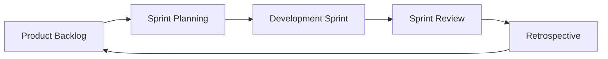

### Scrum Framework

#### Roles

- **Product Owner**: Defines requirements and priorities
- **Scrum Master**: Facilitates the process
- **Development Team**: Builds the product

#### Ceremonies

- **Sprint Planning**: Plan the upcoming sprint
- **Daily Standup**: Daily progress updates
- **Sprint Review**: Demonstrate completed work
- **Sprint Retrospective**: Improve the process

#### Artifacts

- **Product Backlog**: Prioritized list of features
- **Sprint Backlog**: Work selected for the sprint
- **Increment**: Potentially shippable product

### Project Planning

#### Work Breakdown Structure

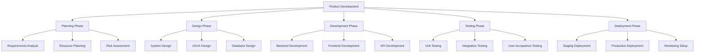

#### Risk Management

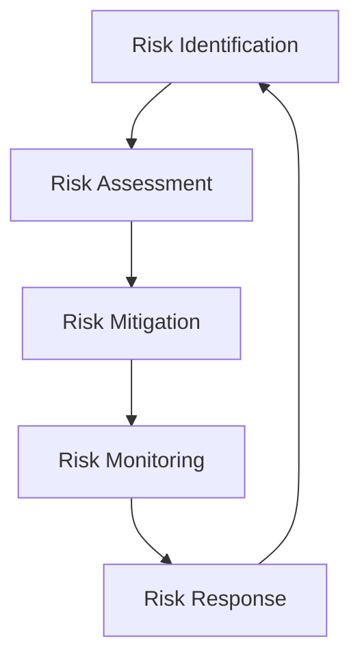

**Common Risks:**

- **Technical Risks**: Technology challenges, integration issues
- **Resource Risks**: Team availability, budget constraints
- **Schedule Risks**: Timeline delays, scope creep
- **Quality Risks**: Performance issues, security vulnerabilities

## Case Studies

### Case Study 1: E-commerce Platform

#### Problem Statement

Build a scalable e-commerce platform that can handle 100,000+ concurrent users.

#### Solution Architecture

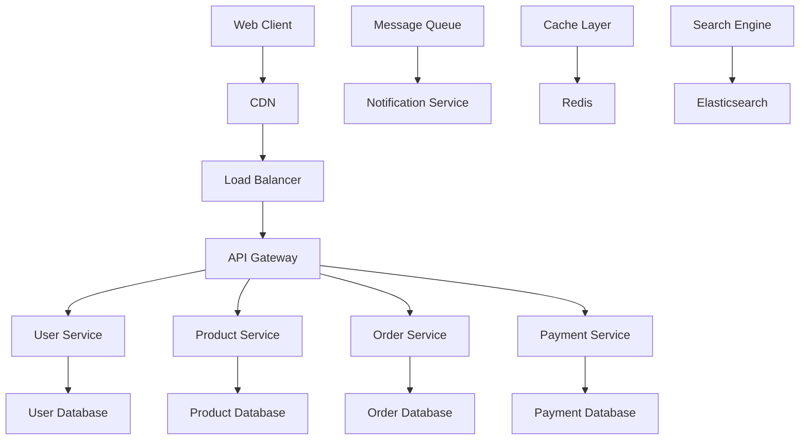

#### Key Decisions

- **Microservices Architecture**: Independent scaling and deployment
- **Event-Driven Communication**: Loose coupling between services
- **Caching Strategy**: Redis for session and product data
- **Database Sharding**: Horizontal scaling for user data

#### Results

- **Performance**: 99.9% uptime, <200ms response time
- **Scalability**: Handled 150,000+ concurrent users
- **Reliability**: Zero data loss, automatic failover

### Case Study 2: Mobile Banking App

#### Problem Statement

Develop a secure mobile banking application with real-time transaction processing.

#### Security Architecture

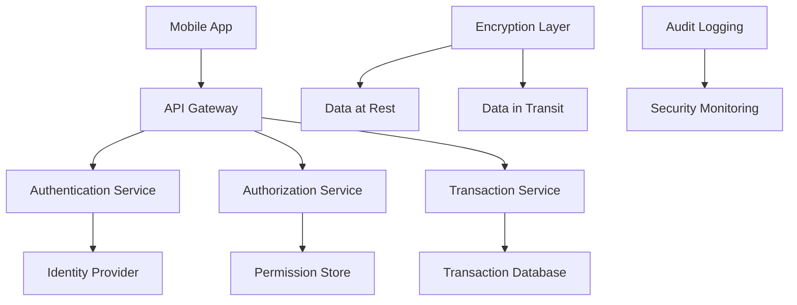

#### Security Measures

- **Multi-factor Authentication**: SMS, biometric, hardware tokens
- **End-to-end Encryption**: All data encrypted in transit and at rest
- **Fraud Detection**: Real-time transaction monitoring
- **Compliance**: PCI DSS, SOX, GDPR compliance

#### Results

- **Security**: Zero security breaches
- **Compliance**: 100% regulatory compliance
- **User Trust**: 95% user satisfaction score

## Best Practices

### Development Best Practices

#### 1. Code Quality

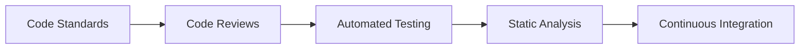

#### 2. Documentation

- **API Documentation**: Comprehensive API documentation
- **Code Comments**: Clear, meaningful code comments
- **Architecture Documentation**: System design documentation
- **User Documentation**: User guides and tutorials

#### 3. Version Control

- **Git Workflow**: Feature branches, pull requests
- **Commit Messages**: Clear, descriptive commit messages
- **Branching Strategy**: GitFlow or GitHub Flow
- **Code Review**: Mandatory code reviews

### Deployment Best Practices

#### 1. CI/CD Pipeline

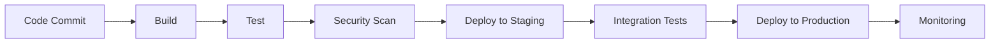

#### 2. Infrastructure as Code

- **Terraform**: Infrastructure provisioning
- **Docker**: Containerization
- **Kubernetes**: Container orchestration
- **Monitoring**: Prometheus, Grafana

#### 3. Security

- **Secrets Management**: Secure credential storage
- **Network Security**: VPC, security groups
- **Access Control**: RBAC, least privilege
- **Audit Logging**: Comprehensive audit trails

### Monitoring and Observability

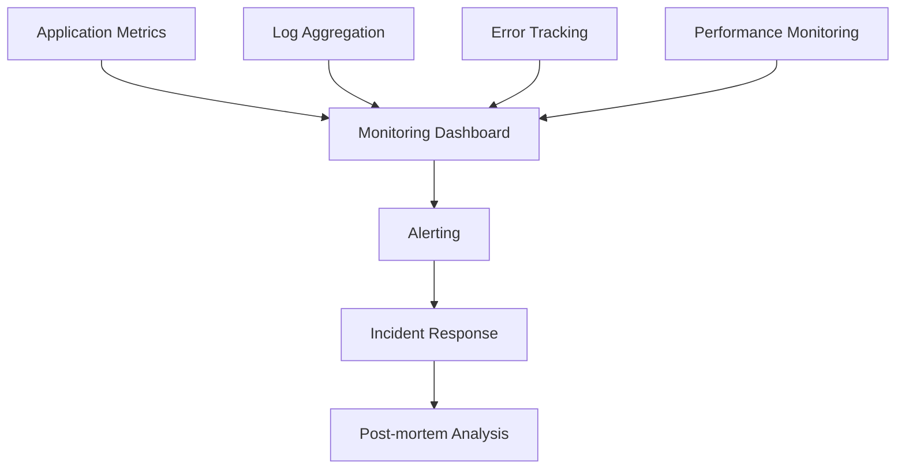

#### Key Metrics

- **Availability**: Uptime percentage
- **Performance**: Response time, throughput
- **Errors**: Error rate, error types
- **Business**: User engagement, conversion rates

## Tools and Technologies

### Development Tools

#### Frontend Development

- **Frameworks**: React, Vue.js, Angular
- **Build Tools**: Webpack, Vite, Parcel
- **Testing**: Jest, Cypress, Playwright
- **Styling**: CSS, Sass, Tailwind CSS

#### Backend Development

- **Languages**: Node.js, Python, Java, Go
- **Frameworks**: Express, Django, Spring Boot
- **Databases**: PostgreSQL, MongoDB, Redis
- **APIs**: REST, GraphQL, gRPC

#### DevOps Tools

- **Version Control**: Git, GitHub, GitLab
- **CI/CD**: Jenkins, GitHub Actions, GitLab CI
- **Containerization**: Docker, Kubernetes
- **Cloud Platforms**: AWS, Azure, GCP

### Project Management Tools

#### Planning and Tracking

- **Jira**: Issue tracking and project management
- **Trello**: Kanban boards
- **Asana**: Task management
- **Monday.com**: Work management

#### Communication

- **Slack**: Team communication
- **Microsoft Teams**: Collaboration
- **Discord**: Developer communities
- **Zoom**: Video conferencing

### Monitoring and Analytics

#### Application Monitoring

- **New Relic**: Application performance monitoring
- **Datadog**: Infrastructure monitoring
- **Sentry**: Error tracking
- **LogRocket**: Session replay

#### Analytics

- **Google Analytics**: Web analytics
- **Mixpanel**: Product analytics
- **Amplitude**: User behavior analytics
- **Hotjar**: User experience analytics

## Future Trends

### Emerging Technologies

#### 1. Artificial Intelligence and Machine Learning

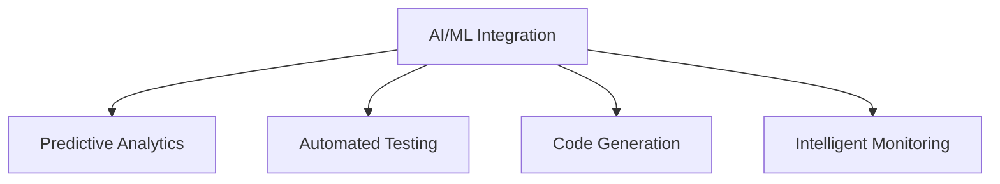

#### 2. Cloud-Native Development

- **Serverless Computing**: Function-as-a-Service
- **Edge Computing**: Processing at the edge
- **Multi-cloud**: Cross-cloud deployments
- **Container Orchestration**: Advanced Kubernetes

#### 3. Low-Code/No-Code Platforms

- **Rapid Prototyping**: Quick solution development
- **Citizen Development**: Non-technical user development
- **Visual Programming**: Drag-and-drop interfaces
- **API-First Design**: API-driven development

### Industry Trends

#### 1. Sustainability in Software

- **Green Computing**: Energy-efficient development
- **Carbon Footprint**: Measuring and reducing impact
- **Sustainable Architecture**: Environmentally conscious design
- **Circular Economy**: Reusable and recyclable components

#### 2. Privacy and Security

- **Privacy by Design**: Built-in privacy protection
- **Zero Trust Architecture**: Never trust, always verify
- **Homomorphic Encryption**: Computation on encrypted data
- **Quantum Security**: Post-quantum cryptography

#### 3. Developer Experience

- **Developer Productivity**: Tools and processes for efficiency
- **Inner Source**: Open source practices within organizations
- **Platform Engineering**: Developer platform teams
- **API-First Culture**: API-centric development

### Skills for the Future

#### Technical Skills

- **Cloud Computing**: Multi-cloud expertise
- **AI/ML Integration**: Machine learning in products
- **Security**: Cybersecurity expertise
- **Performance**: Optimization and scalability

#### Soft Skills

- **Communication**: Cross-functional collaboration
- **Leadership**: Technical leadership
- **Adaptability**: Continuous learning
- **Problem Solving**: Complex problem resolution

## Conclusion

Product Engineering is a dynamic field that combines technical expertise with business acumen to create valuable products. Success requires:

1. **User-Centric Approach**: Always prioritize user needs
2. **Technical Excellence**: Build robust, scalable solutions
3. **Continuous Learning**: Stay updated with new technologies
4. **Collaboration**: Work effectively with cross-functional teams
5. **Quality Focus**: Maintain high standards throughout development

The future of product engineering will be shaped by emerging technologies like AI/ML, cloud-native development, and sustainability considerations. Engineers who adapt to these trends and maintain a focus on user value will thrive in this evolving landscape.

---
